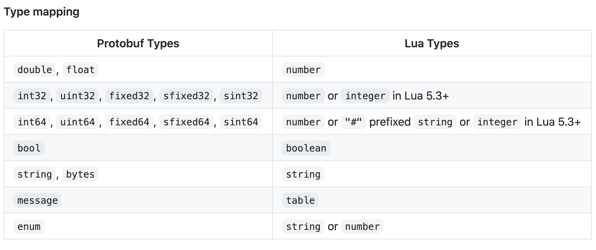
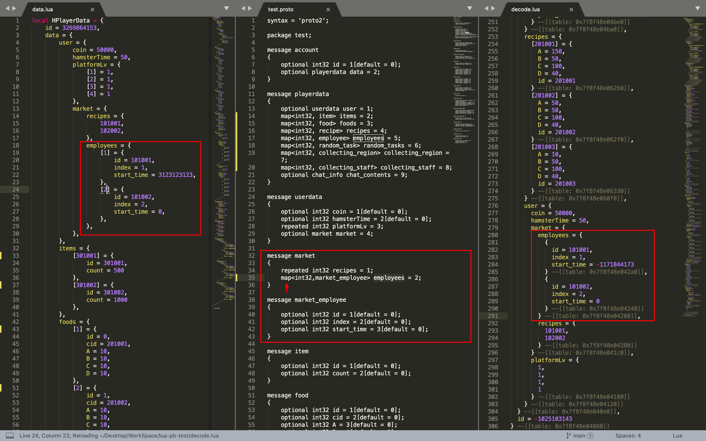
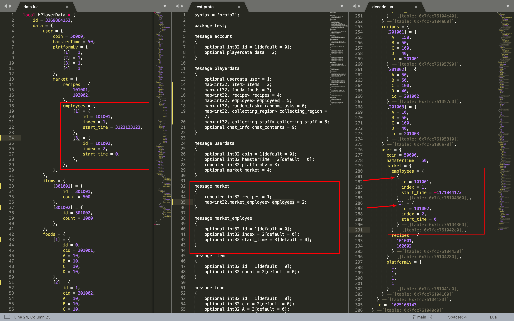
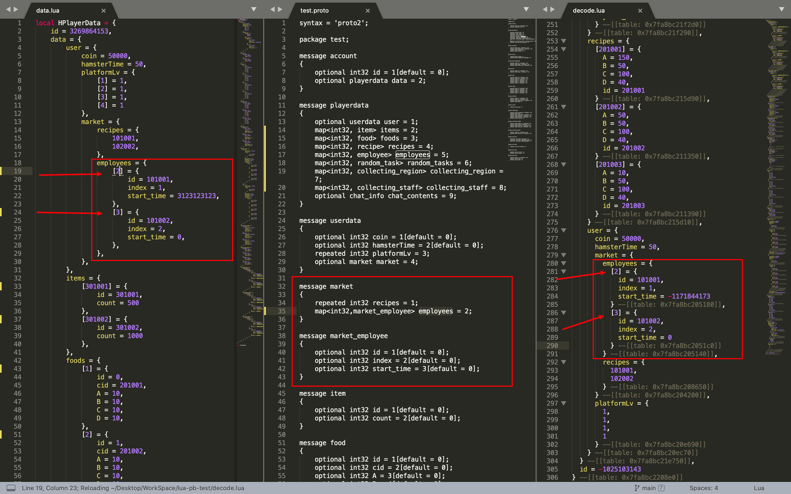

# lua-pb-test
测试luapb文件

## 文件介绍

* data.lua 
  * 需要序列化的源文件
* test.proto
  * proto结构描述文件
* test.pb
  * proto编译过后的二进制pb文件
* testpb.lua
  * 测试过程逻辑代码
* serpent.lua
  * lua开源序列化为字符串的库
* protoc
  * 将.proto编译为.pb文件的程序，当前版本为3.4.0
* runtest.sh
  * 快速测试shell程序

## 可能的依赖

* lua
  * 测试lua版本为5.3.5，需要自己下载
  * lua官网[这里]{www.lua.org}
  * 编译需要安装readline库
* luarocks
  * brew install luarocks
  * 安装luarocks中的lua-protobuf库
    * luarocks install lua-protobuf

## 测试步骤

* 将需要加入的数据手动写入data.lua，只需要写部分测试即可

* 修改test.proto，写入对应加入数据的格式描述

* 在cmd中cd到工程目录，执行

  * ``` shell
    sh run.sh
    ```

* 执行结束后，cmd会输出successful表示完成，此时的encode.data为data.lua按照test.pb的描述压缩后的文件，decode.lua为encode.data按照test.pb解压缩后的数据

## 数据类型对应关系

* 

## 常见问题

* proto在encode的时候会优化数据，例如map中的key是int,并且是从1开始连续的，那么在encode后的结构和list是一样的，因为对lua来说访问方式是一样的，非1开始连续的元素还是会和原有map结构一致
  * 
  * 
  * 